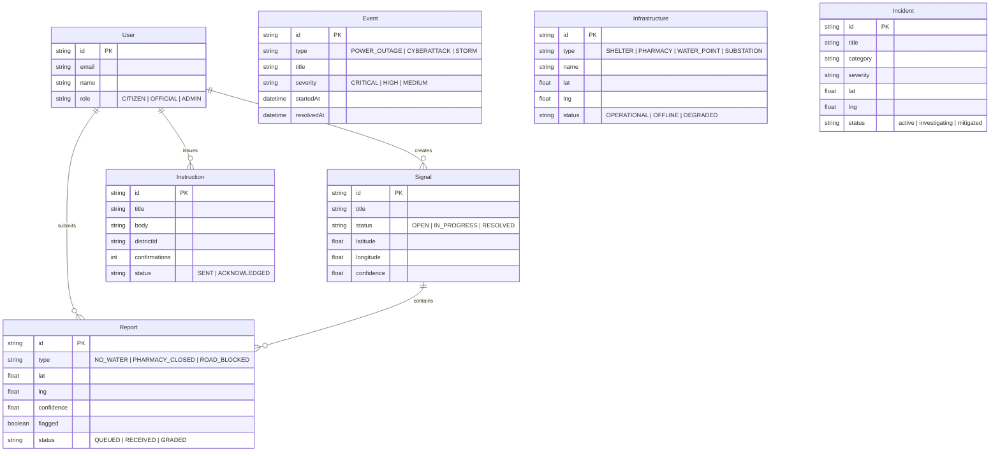

# 🌆 Neural City

[](https://nextjs.org/)
[](https://react.dev/)
[](https://tailwindcss.com/)
[](https://www.prisma.io/)
[](https://www.sqlite.org/)
[](https://maplibre.org/)

**Neural City** is an advanced, real-time urban infrastructure monitoring, crisis management, and emergency response platform. It fuses live GIS spatial feeds, public transit tracking, telemetry data (vessels & flights), citizen incident reporting, and an AI-driven Copilot assistant into an interactive command dashboard.

---

## 📑 Table of Contents

- [Key Features](#-key-features)
- [System Architecture](#-system-architecture)
- [Tech Stack](#-tech-stack)
- [Project Directory Structure](#-project-directory-structure)
- [Data Model & Database Schema](#-data-model--database-schema)
- [Quick Start (1-Click Launcher)](#-quick-start-1-click-launcher)
- [Manual Setup for Developers](#-manual-setup-for-developers)
- [Database Management Commands](#-database-management-commands)
- [API Routes & Services](#-api-routes--services)
- [AI Assistant Subsystem](#-ai-assistant-subsystem)
- [Testing & Quality Assurance](#-testing--quality-assurance)

---

## Screenshots


---

## ✨ Key Features

1. **Interactive Real-Time GIS Map**
   - Built on **MapLibre GL** and **React Map GL**.
   - Dynamic vector decluttering, custom markers, district boundaries, and interactive popovers.
   - Layers for critical infrastructure, incidents, public transit, maritime vessels, and aerial flights.

2. **Real-Time Public Transport Tracking**
   - Live GTFS-RT feed integration (including Tallinn live bus telemetry and transport hub monitoring).
   - Smooth position updates and customized vehicle icons for buses, trams, and trains.

3. **Crisis Timeline & Disaster Cascade Replay**
   - Interactive crisis timeline player for reviewing historical emergency cascades and disaster simulations (e.g., power grid collapses, storms, urban disruption events).
   - YouTube-style fullscreen media player with keyboard navigation shortcuts (`Space`, `F`, `M`, Arrow keys).

4. **Multi-Source Live Telemetry & Traffic Engines**
   - WebSocket streaming backend for continuous telemetry data broadcast (`/api/telemetry`).
   - Dynamic urban traffic simulation engine alongside live vessel and flight tracking feeds.

5. **Integrated AI Copilot Assistant**
   - AI agent drawer with rich Markdown support (`MarkdownRenderer.tsx`), syntax highlighting, and dynamic layout resizing.
   - Autonomous signal confidence grading, automated report ingestion, and emergency instruction dispatching.

6. **Offline-Resilient Incident Reporting**
   - Queueing and confidence-scoring system for citizen-submitted incident reports (`Signal` and `Report` models).

---

## 🏗 System Architecture

The Neural City platform is structured into three main layers:

```
                  ┌──────────────────────────────────────────────┐
                  │           Next.js 16 Client (App Router)      │
                  │   React 19 + MapLibre GL + Tailwind CSS v4   │
                  └──────────────────────┬───────────────────────┘
                                         │ REST API / WebSockets
                                         ▼
                  ┌──────────────────────────────────────────────┐
                  │               Backend Layer                  │
                  │      Next.js Route Handlers / Controllers    │
                  ├──────────────────────┬───────────────────────┤
                  │                      │                       │
                  ▼                      ▼                       ▼
      ┌────────────────────┐   ┌───────────────────┐   ┌───────────────────┐
      │ Telemetry Services │   │ Prisma ORM Client │   │ AI Agent Engine   │
      │ (GTFS, AIS, Flight)│   │ SQLite (dev.db)   │   │ Signal Evaluation │
      └────────────────────┘   └───────────────────┘   └───────────────────┘
```

- **Frontend Tier**: Next.js 16 App Router using React 19 server/client components, Tailwind CSS v4, and Lucide React icons.
- **Backend Tier**: Modular Controllers (`app/backend/controllers`) and Services (`app/backend/services`) serving dedicated endpoints (`/api/*`).
- **Real-Time Telemetry Engine**: WebSockets (`ws`) server handler pushing real-time positioning updates to client maps.
- **Data Tier**: Prisma ORM connecting to a local SQLite database (`dev.db`).
- **AI Agent System**: Standalone testable AI sub-agent (`app/ai_agent`) for processing incoming signals and automating emergency response instructions.

---

## 💻 Tech Stack

| Domain | Technologies |
| :--- | :--- |
| **Framework** | Next.js 16.3.4 (App Router), React 19.2.8 |
| **Language** | TypeScript 5.x |
| **Styling & UI** | Tailwind CSS v4, Base UI, Shadcn primitives, Lucide React icons |
| **Geospatial & Maps** | MapLibre GL 6.7, React Map GL 8.1 |
| **Database & ORM** | SQLite, Prisma ORM 6.19 |
| **Real-time Engine** | WebSockets (`ws` 8.21) |
| **Markdown / AI UI**| React Markdown 10.1, Remark GFM |
| **Developer Tools** | `tsx` test runner, ESLint 9 |

---

## 📁 Project Directory Structure

```
city-signal/
├── start.command           # macOS 1-click launcher script
├── start.bat               # Windows 1-click launcher script
├── start.js                # Cross-platform startup launcher & browser opener
├── README.md               # Documentation
└── app/                    # Main Application Directory
    ├── app/                # Next.js App Router (Pages & API Routes)
    │   ├── api/            # API Route Handlers
    │   │   ├── buses/          # Real-time GTFS / bus telemetry endpoint
    │   │   ├── chat/           # AI Copilot chat streaming API
    │   │   ├── flights/        # Live aerial traffic endpoint
    │   │   ├── incidents/      # Incident CRUD & telemetry
    │   │   ├── infrastructure/ # Urban infrastructure nodes API
    │   │   ├── media/          # Video/media feed proxy endpoint
    │   │   ├── telemetry/      # Telemetry feed API & WebSocket route
    │   │   └── vessels/        # Live marine vessel position endpoint
    │   ├── globals.css     # Global CSS tokens & Tailwind CSS v4 imports
    │   ├── layout.tsx      # Root HTML layout container
    │   └── page.tsx        # Main Dashboard entry point
    ├── ai_agent/           # Autonomous AI Agent engine & test suite
    ├── backend/            # Modular backend services & controllers
    │   ├── controllers/    # Express/Next-style request controllers
    │   ├── db/             # Prisma client instance singleton
    │   ├── services/       # Transport, telemetry, traffic, & incident services
    │   └── ws/             # WebSocket server implementation
    ├── frontend/           # Client-side components & utilities
    │   ├── actions/        # Server actions & data fetchers
    │   ├── components/     # UI components
    │   │   └── dashboard/  # Main MapContainer, CrisisTimeline, Sidebar, AI drawers
    │   ├── hooks/          # Custom React hooks (telemetry streams, audio/video state)
    │   └── lib/            # Helper functions & utility methods
    ├── prisma/             # Database schema and seed data
    │   ├── dev.db          # Local SQLite database instance (auto-generated)
    │   ├── schema.prisma   # Prisma schema definitions
    │   └── seed.ts         # Sample database seeder script
    ├── .env.example        # Environment variable template
    ├── package.json        # Dependencies & NPM scripts
    └── tsconfig.json       # TypeScript configuration
```

---

## 🗄 Data Model & Database Schema

The database relies on **Prisma ORM** targeting an **SQLite** database (`prisma/dev.db`). Main entities defined in `prisma/schema.prisma` include:



---

## ⚡ Quick Start (1-Click Launcher)

The platform includes an automated 1-click startup system (`start.js`) for macOS and Windows.

### macOS
Double-click `start.command` in Finder or execute from terminal:
```bash
./start.command
```

### Windows
Double-click `start.bat` in File Explorer or execute from command prompt:
```cmd
start.bat
```

> **Automated Workflow:**
> 1. Opens a new dedicated terminal window.
> 2. Automatically verifies and installs NPM dependencies inside `app/` if missing.
> 3. Launches the Next.js development server with a terminal progress bar.
> 4. Polls `http://localhost:3000` until responsive and automatically launches **Google Chrome**.

---

## 🛠 Manual Setup for Developers

If you prefer step-by-step terminal installation:

### 1. System Requirements
- **Node.js**: `v20.0.0` or higher
- **npm**: `v10.0.0` or higher

### 2. Install Dependencies
Navigate into the `app/` directory and install dependencies:
```bash
cd app
npm install
```

### 3. Environment & Database Setup
Copy the environment template and initialize the SQLite database:

```bash
# 1. Copy environment variable template
cp .env.example .env

# 2. Push schema to local SQLite database (dev.db)
npm run db:push

# 3. Seed starter dataset (users, incidents, infrastructure nodes)
npm run db:seed
```

### 4. Run Development Server
Start the Next.js development server:
```bash
npm run dev
```

Open **[http://localhost:3000](http://localhost:3000)** in your browser.

---

## 🗄 Database Management Commands

Run these commands inside the `app/` directory:

| Command | Action |
| :--- | :--- |
| `npm run db:push` | Pushes schema changes directly to SQLite (`dev.db`) |
| `npm run db:seed` | Populates database with sample starter data |
| `npm run db:migrate` | Generates and executes a new Prisma migration |
| `npm run db:studio` | Opens Prisma Studio GUI in browser (`http://localhost:5555`) |

---

## 🌐 API Routes & Services

The application exposes several high-performance API endpoints (`app/app/api/`):

- `GET /api/buses` - Real-time Tallinn GTFS public transit location tracking feed.
- `GET /api/incidents` - Incident list, filtering, and GIS location attributes.
- `GET /api/infrastructure` - Urban infrastructure operational status and coordinates.
- `GET /api/vessels` - Live maritime traffic telemetry stream.
- `GET /api/flights` - Live aerial traffic tracking feed.
- `POST /api/chat` - AI Copilot stream processing endpoint.
- `GET /api/telemetry` - Live WebSocket broadcast handshake endpoint for real-time map updates.

---

## 🤖 AI Assistant Subsystem

The **AI Agent Engine** (`app/ai_agent`) is designed to parse real-time signals, filter noise, and generate response strategies.

- **System Prompt & Harness**: Configured with automated orchestration rules for city emergency management.
- **Markdown & Render Engine**: Supports full GitHub Flavored Markdown rendering with syntax highlighting in `MarkdownRenderer.tsx`.
- **Unit Testing**: Contains unit tests verifying AI signal processing logic.

---

## 🧪 Testing & Quality Assurance

To execute unit tests for the AI agent engine and core controllers, run:

```bash
cd app
npm run test
```

This runs `tsx --test ai_agent/__tests__/ai.test.ts` to validate signal processing and prompt execution logic.
