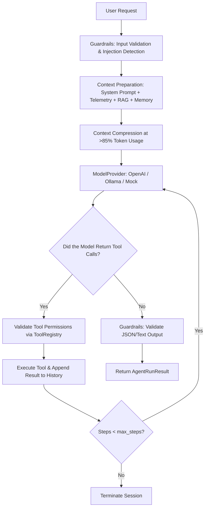

# 🤖 Neural City AI Engine & Agent Harness (`app/ai/`)

This module represents a **dedicated, isolated subsystem for AI functionality** within the Neural City project.

All AI-related processes — from configuration loading and language-model interaction to tool execution, RAG retrieval, context management, security, and logging — are isolated within this directory.

---

## 🎯 Why does this module exist?

1. **Single Control Point (Decoupling)**
   Application code (UI, Next.js API routes, databases) no longer contains hardcoded prompts or direct `fetch` calls to AI models. All AI logic is encapsulated within this module.

2. **Declarative Configuration (`config.yaml`)**
   Models, temperature, reasoning effort, token limits, tool permissions, and security settings can be changed **without rewriting application code** — only the configuration needs to be modified.

3. **Autonomous Agent Harness**
   Supports autonomous agents capable of executing the `Model → Tool Call → Model` loop for up to `max_steps` iterations, with execution-time limits and permission controls.

4. **Security & Observability**
   Provides automatic Prompt Injection detection, API-key masking in logs, and controlled execution of write operations.

---

## 📂 File Structure & Module Responsibilities

```text
app/
└── ai/                              # 🧠 Dedicated AI module
    ├── README.md                    # This documentation
    ├── index.ts                     # Main entry point and public module API
    ├── types.ts                     # Strict TypeScript types for configs and messages
    ├── config.ts                    # YAML configuration loader with environment-variable support
    ├── harness.ts                   # Agent Harness engine (agent loop, timeouts, context selection)
    │
    ├── config/                      # ⚙️ AI Configuration directory
    │   ├── config.yaml              # Base system configuration
    │   ├── config.dev.yaml          # Development environment configuration
    │   ├── config.prod.yaml         # Production environment configuration
    │   ├── prompts/
    │   │   └── system.md            # System prompt for the urban intelligence agent
    │   └── schemas/
    │       └── agent_response.json  # JSON schema for agent response validation
    │
    ├── providers/                   # 🔌 Model Providers
    │   ├── interface.ts              # Provider interface / contract
    │   ├── openai.ts                 # OpenAI provider (reasoning effort, temperature, top_p)
    │   ├── ollama.ts                 # Local Ollama provider (Qwen2.5, Llama 3) + streaming
    │   └── mock.ts                   # Mock provider for fast testing and development
    │
    ├── tools/                       # 🛠️ Tool system and permissions
    │   └── registry.ts              # Tool registry, permission checks, and execution
    │
    ├── safety/                      # 🛡️ Safety / Guardrails
    │   └── guardrails.ts            # Input validation, Prompt Injection detection, response validation
    │
    ├── context/                     # 📏 Context management
    │   └── manager.ts               # Token counting, prioritization, and context compression at 85%+
    │
    ├── memory/                      # 🧠 Agent memory
    │   └── store.ts                 # Conversation-history trimming and long-term memory interface
    │
    ├── retrieval/                   # 🔍 RAG (Retrieval-Augmented Generation)
    │   └── rag.ts                   # Vector search across incidents and infrastructure collections
    │
    └── observability/               # 📊 Logging and metrics
        └── logger.ts                # Logging with secret masking (`sk-...`, `Bearer ...`)
```

---

## ⚙️ How Configuration Works (`config.yaml`)

The system loads configuration from:

`app/ai/config/config.yaml`

### 🔄 Configuration Loading Hierarchy (`app/ai/config.ts`)

1. The base `config.yaml` is loaded.
2. If the application is running with `NODE_ENV=production`, values from `config.prod.yaml` are merged on top. Otherwise, `config.dev.yaml` is applied.
3. Environment-variable placeholders such as `${DATABASE_URL}` and `${MCP_INCIDENTS_URL}` are automatically resolved from `process.env`.

### 🔑 Main Configuration Sections

```yaml
# 1. MODEL

model:
  provider: "ollama"             # openai | ollama | mock
  name: "qwen2.5:7b"             # Model name, e.g. gpt-4o, qwen2.5:7b
  temperature: 0.2               # Sampling temperature
  top_p: 1.0                     # Nucleus sampling parameter
  max_output_tokens: 4096        # Maximum number of generated tokens

  reasoning:
    enabled: true
    effort: "medium"             # Reasoning effort: low | medium | high

  timeout_seconds: 120            # AI request timeout
  max_retries: 3                  # Number of retries after failures


# 2. AGENT

agent:
  name: "urban-intelligence"

  system_prompt:
    file: "./ai/config/prompts/system.md"

  max_steps: 10                   # Maximum Model → Tool → Model iterations
  max_execution_time_seconds: 180 # Prevent infinite execution loops

  capabilities:
    tool_calling: true             # Allow tool/function calls
    retrieval: true                # Enable RAG retrieval
    memory: true                   # Enable memory
    planning: true                 # Allow multi-step planning


# 3. TOOLS & PERMISSIONS

tools:
  enabled:                        # Allowlist of enabled tools
    - "search_incidents"
    - "get_incident"
    - "query_gis"
    - "get_weather"
    - "search_infrastructure"

  permissions:
    search_incidents:
      enabled: true
      read_only: true              # Read-only operation

  write_operations:
    enabled: false                 # Write/mutation operations disabled
    require_confirmation: true     # Require explicit user confirmation


# 4. SAFETY

safety:
  enabled: true

  input:
    validation: true
    max_length: 20000              # Maximum input length

  prompt_injection:
    detection: true                # Detect prompt injection attempts
```

---

## ⚡ Agent Harness — The Execution Engine (`app/ai/harness.ts`)

`AgentHarness` is the central class responsible for managing the lifecycle of a single request or a multi-step agent session.

### 🔄 Request Execution Flow (`harness.run()`)



### 🧠 What does `AgentRunResult` return?

* `content` — Final textual or JSON model response.
* `model` — Name of the model actually used.
* `stepsCount` — Number of execution iterations.
* `toolCallsCount` — Total number of tools called by the model.
* `executionTimeMs` — Total execution time in milliseconds.
* `warnings` — Security warnings or output-format violations.

---

## 🛠️ Extending the System

### 1. Adding a New Tool

Open `app/ai/tools/registry.ts` and register the tool:

```typescript
this.registerTool({
  name: "get_substation_status",
  description: "Get the detailed status of a substation by its code.",
  isWriteOperation: false,

  parameters: {
    type: "object",
    properties: {
      substationId: {
        type: "string",
        description: "Substation identifier"
      }
    },
    required: ["substationId"]
  },

  execute: async (args) => {
    const id = args.substationId as string;

    return {
      id,
      status: "NOMINAL",
      voltage: "110kV"
    };
  }
});
```

Then add `"get_substation_status"` to the `tools.enabled` allowlist in `config.yaml`.

### 2. Adding a New Model Provider

Create a new file under:

`app/ai/providers/my_provider.ts`

Implement the `ModelProvider` interface from:

`app/ai/providers/interface.ts`

Then register the provider in the `getProvider()` method in:

`app/ai/harness.ts`

---

## 🚀 Usage Examples

### Running the Agent from an API Route

```typescript
import { NextResponse } from "next/server";
import { executeAgent, streamAgent } from "@/ai";

export async function POST(request: Request) {
  const { messages, context, stream } = await request.json();

  if (stream) {
    const readableStream = await streamAgent({
      messages,
      context
    });

    return new Response(readableStream, {
      headers: {
        "Content-Type": "text/plain; charset=utf-8"
      }
    });
  }

  const result = await executeAgent({
    messages,
    context
  });

  return NextResponse.json({
    content: result.content,
    executionTimeMs: result.executionTimeMs
  });
}
```

### Runtime Parameter Overrides

Individual requests can override selected configuration values:

```typescript
import { executeAgent } from "@/ai";

const result = await executeAgent({
  messages: [
    {
      role: "user",
      content: "Hello!"
    }
  ],

  modelOverride: "gpt-4o",
  temperatureOverride: 0.7
});
```

---

## ✅ Guarantees & Security

* **No API Key Leakage** — `AiLogger` masks sensitive credentials such as `sk-...` and `Bearer ...` tokens in logs.
* **Strict Type Safety** — The entire module is implemented in TypeScript with `strict: true`.
* **Tool Allowlisting** — Only explicitly enabled tools can be called by the agent.
* **Write Protection** — Write operations are disabled by default and can require explicit user confirmation.
* **Execution Limits** — Agent execution is bounded by both `max_steps` and `max_execution_time_seconds`.
* **Provider Abstraction** — The application is not tightly coupled to a single AI provider.
* **Environment Separation** — Development and production configurations are independently managed.
